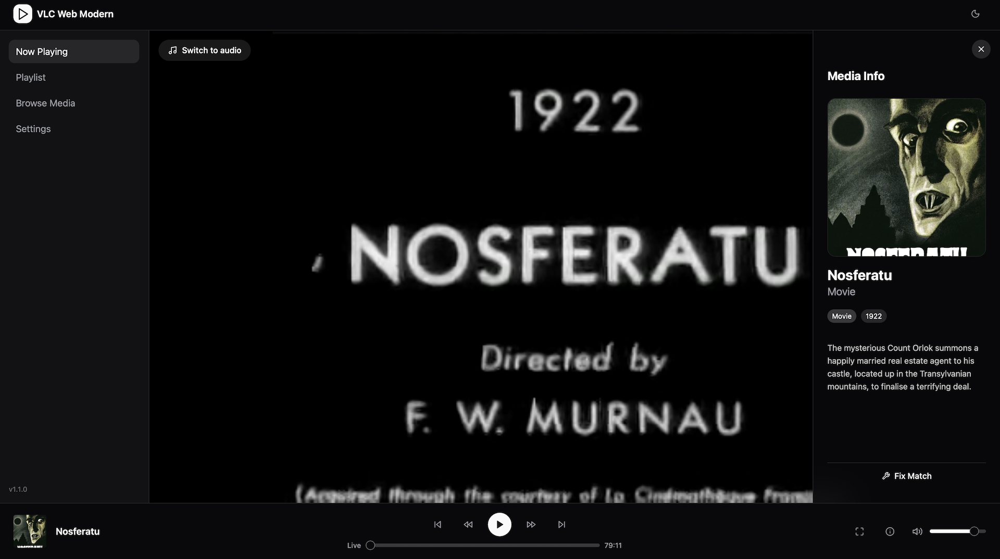

# VLC Web Modern 🎬

A completely overhauled, incredibly sleek, and fully-featured modern Web Interface for VLC Media Player. 

Built beautifully from the ground up using **React**, **Vite**, **Tailwind CSS**, and **Glassmorphism**, it upgrades the VLC web remote experience into a premium, responsive, and cinematic control center right in your web browser. 

It also ships with a custom metadata extraction engine, smartly pulling rich series synopses and high-resolution posters from your favorite television databases (TMDB, TheTVDB, TVMaze) to breathe life into your media library!

---

## 🚀 Features
- **Cinematic UI**: A gorgeous glassmorphic aesthetic with seamless light/dark mode support.
- **Smart Metadata Loading**: Forget ugly filenames. The UI uses regex-based extraction tools to fetch high-res posters, release years, and plot summaries directly from iTunes, TheTVDB, TMDB, or TVMaze. 
  - *Tip:* For best results, it is highly recommended to name your files using the standard Plex naming conventions for [Movies](https://support.plex.tv/articles/naming-and-organizing-your-movie-media-files/) and [TV Shows](https://support.plex.tv/articles/naming-and-organizing-your-tv-show-files/).
- **TV vs Movie Isolation**: Easily set a default metadata provider for your Movies, and a distinctly separate provider for your TV Shows.
- **Powerful 'Fix Match'**: For files that just will not parse quite right, instantly open a sleek modal to explicitly tell the metadata engine what the file is—even isolating it to override the default metadata provider!
- **Fluid Playback Controls**: Instantly skip forward, skip backwards, seek anywhere using the progress bar, and switch between Audio and Video streams in real-time. 
- **Lightning Fast**: Fully bespoke build optimized precisely for serving from your local VLC instance overhead-free.

---

## 🔧 Installation Instructions (For Normies)
*Note: Make sure your VLC is closed and not running before replacing these files!*

1. Find where your system's VLC is installed, and locate the `lua/http` folder.
   - **MacOS:** `/Applications/VLC.app/Contents/MacOS/share/lua/http/` (Right click VLC -> Show Package Contents to dig into it)
   - **Windows:** `C:\Program Files\VideoLAN\VLC\lua\http`
   - **Linux:** `/usr/share/vlc/lua/http/`
2. **IMPORTANT**: Make a backup of the original `http` folder. Move or rename the exiting directory to `old_http`. 
3. Download/clone this repository and copy all the files into the empty `http` directory! Let the `index.html` file exist at the root of `http/`.
4. Open VLC Media Player.
5. In the top toolbar navigate to **Tools -> Preferences** (or **VLC -> Preferences** on Mac).
6. At the bottom left, under **Show settings**, click **"All"**.
7. In the left panel, scroll down to **Interface -> Main interfaces** and check the box that says **"Web"**.
8. Expand the **Main interfaces** section by clicking the tiny plus/arrow icon, click on **Lua**, and under "Lua HTTP", set a simple password (e.g., `vlc`).
9. Close settings and restart VLC!
10. Open up your browser and enter `http://localhost:8080` to blast off into your brand new interface! (When prompted for a password, log in using the one you set in step 8!)

---

## 🔑 Fetching Metadata (API Keys)
VLC Web Modern leverages four distinct Metadata Providers to automatically pull beautiful metadata for your library.
- **iTunes Search API**: Completely free, unlimited, and enabled by default. Often best for pure music metadata and widely-known standard feature films.
- **TVMaze**: A purely TV-show focused database that requires zero configuration.
- **TheTVDB (Recommended for TV)**: The premiere high-res database for flawless TV Show scraping. 
  - To use TheTVDB, you must sign up for a (free or paid) membership at [TheTVDB API Sign Up](https://www.thetvdb.com/api-information), and generate a `v4 User API Key`. Copy and Paste this Key into your VLC Web Modern **Settings** page!
- **The Movie Database / TMDB (Recommended for Movies)**: A massive powerhouse of high-res cinematic metadata.
  - To use TMDB, create a free account and navigate to [The Movie DB API Request page](https://developer.themoviedb.org/docs/faq) to request an API Key. You will be provided a long **`API Read Access Token`**. Copy and Paste this long Token into your VLC Web Modern **Settings** page!

*All configurations and custom overrides are saved locally within your personal browser cache.*
